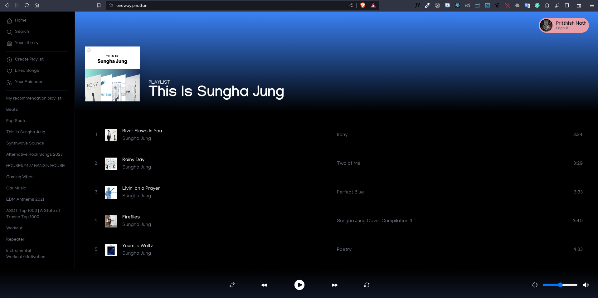

## Oneway App

Basic Spotify UI based design with few Spotify API functionality implemented for demonstration purpose.

Click here for <a href="https://oneway.pnath.in" target="_blank">live demo</a>.



#### Description

To play sound tracks Spotify premium accounts is required, and a logged in device is required to be opened parallelly (Spotify android app or web player in another browsing session).

#### Technologies Used

NextJS | Tailwind CSS | NextAuth | Recoil | Github Actions - CD

#### Usage

Running the development server:

```bash
npm run dev
# or
yarn dev
# or
pnpm dev
# or
bun dev
```

Open [http://localhost:3000](http://localhost:3000) with your browser to see the result.
